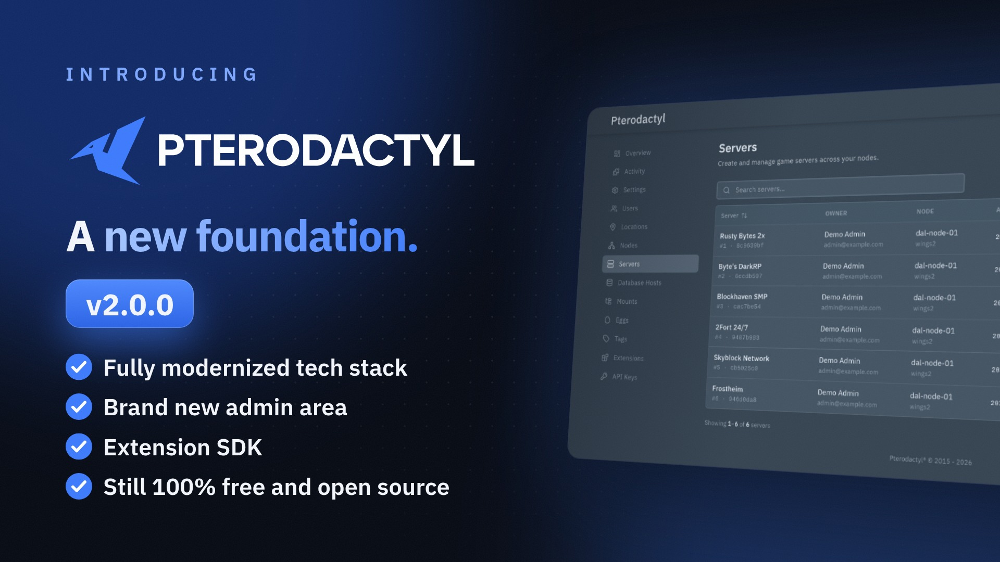

  <a href="https://pterodactyl.io">
    <picture>
      <source media="(prefers-color-scheme: dark)" srcset=".github/assets/logo-dark.svg">
      
    </picture>
  </a>

# Pterodactyl Wings

Wings is Pterodactyl's server control plane, built for the rapidly changing gaming industry and designed to be
highly performant and secure. Wings provides an HTTP API allowing you to interface directly with running server
instances, fetch server logs, generate backups, and control all aspects of the server lifecycle.

In addition, Wings ships with a built-in SFTP server allowing your system to remain free of Pterodactyl specific
dependencies, and allowing users to authenticate with the same credentials they would normally use to access the Panel.

## Pterodactyl v2 is coming soon

Wings is stable and remains the daemon for Pterodactyl: the same Wings is used with the upcoming Panel v2.

## Sponsors

I would like to extend my sincere thanks to the following sponsors for helping fund Pterodactyl's development.
[Interested in becoming a sponsor?](https://github.com/sponsors/pterodactyl)

| Company                                                                           | About                                                                                                                                                                                                                                           |
|-----------------------------------------------------------------------------------|-------------------------------------------------------------------------------------------------------------------------------------------------------------------------------------------------------------------------------------------------|
| [**Buildurly**](https://buildurly.com/)                                           | Buildurly is a hardware procurement company. They deliver tailored, enterprise-grade hardware solutions designed around your unique needs. From sourcing to delivery, Buildurly's white-glove service ensures a seamless, worry-free, professional experience.                                                                                                                                          |
| [**Hosturly**](https://hosturly.com/)                                             | Hosturly is an enterprise hosting provider. They provide cost-effective, high-performance, and reliable services, including VPS, Web, Dedicated, and Colocation.                                                                                |
| [**indifferent broccoli**](https://indifferentbroccoli.com/)                      | indifferent broccoli is a game server hosting and rental company. With them, you get top-notch computer power for your gaming sessions. They destroy lag, latency, and complexity--letting you focus on the fun stuff.                         |
| [**Infraly, LLC**](https://infraly.co/)                                           | Infraly is an infrastructure company powering the next generation of online services. Through their brands, Infraly delivers cutting-edge solutions across multiple markets. Their vertically integrated approach provides unmatched performance, scalability, and reliability, giving our customers full control.                                                                                     |
| [**MineStrator**](https://minestrator.com/)                                       | MineStrator is a game server hosting provider. Looking for the most high-end French hosting company for your Minecraft server? More than 24,000 members on our Discord trust us. Give us a try!                                                |
| [**Physgun**](https://physgun.com/)                                               | Physgun is a game server hosting provider. Most providers rent rack space and rebrand a panel. At Physgun, they engineer the performance, write the features, and staff the support. Physgun truly is game hosting perfected!                   |
| [**WISP**](https://wisp.gg/)                                                      | WISP is an industry-leading SaaS platform for game server management, designed for hosting companies, gaming organizations, and enthusiasts. WISP combines modern, intuitive interfaces with powerful tools, making server deployment and administration seamless, scalable, and efficient.     

## Documentation

* [Panel Documentation](https://pterodactyl.io/panel/1.0/getting_started.html)
* [Wings Documentation](https://pterodactyl.io/wings/1.0/installing.html)
* [Community Guides](https://pterodactyl.io/community/about.html)
* Or, get additional help [via Discord](https://discord.gg/pterodactyl)

## Reporting Issues

Please use the [pterodactyl/panel](https://github.com/pterodactyl/panel) repository to report any issues or make
feature requests for Wings. In addition, the [security policy](https://github.com/pterodactyl/panel/security/policy) listed
within that repository also applies to Wings.
